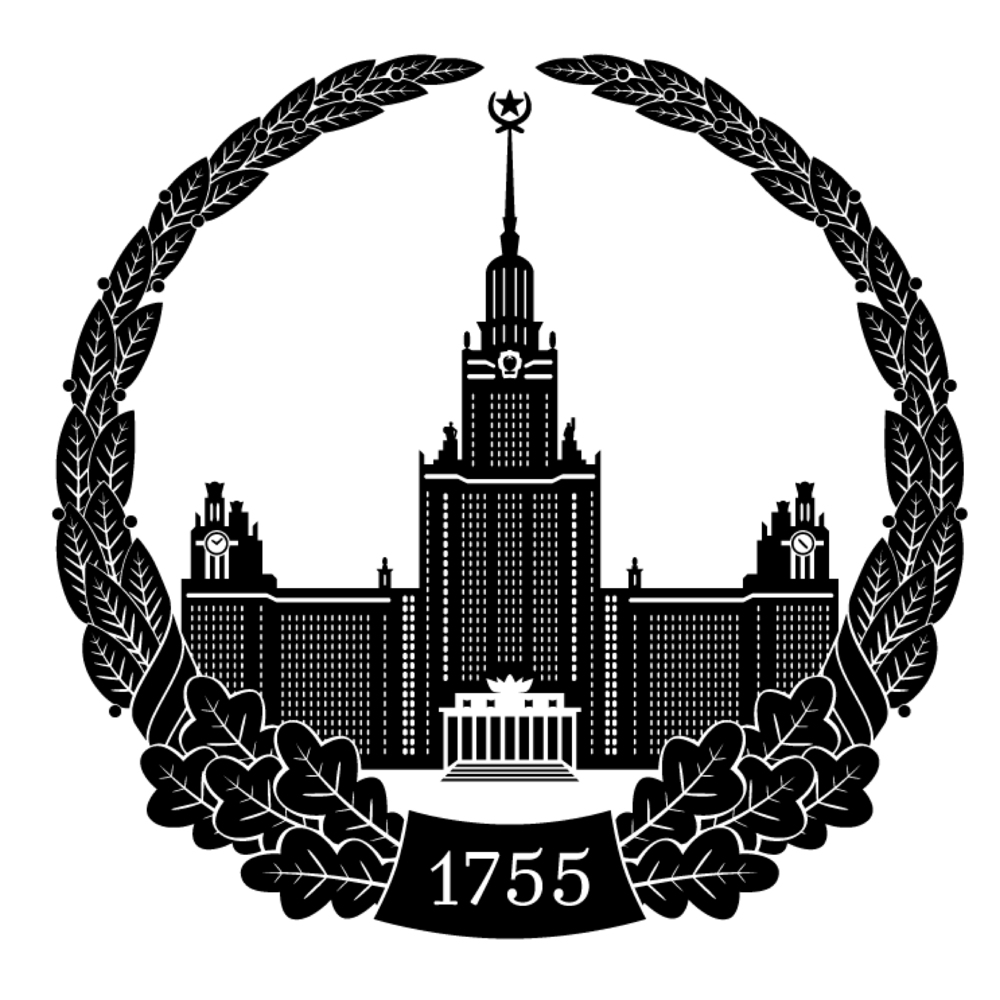

# Aleksei Naumov

---

**Feel free to reach out!**
> 📫 [**alekseis.naumov@gmail.com**](mailto:alekseis.naumov@gmail.com)\
>  [**Linkedin**](https://www.linkedin.com/in/aleksei-naumov-983636174)\
>  [**Telegram**](https://t.me/aleksei_conf)\
>  [**Twitter**](https://twitter.com/naum_naum_naum)\
>  [**My Papers On Google Scholar**](https://scholar.google.com/citations?user=leIN9mMAAAAJ) \
> 📄 [**My CV**](https://docs.google.com/document/d/1SiWth-cN8H7DJMDz5Dz3vsKRY1W-AkER7P7aQzQ3vzA/edit?usp=sharing)

## About me

> I’m an **Lead AI Product Engineer**, working on building **AI voice-assistant** in **[Terra Quantum](https://techcrunch.com/2022/01/20/terra-quantum-raises-60m-for-its-quantum-as-a-service-platform/?guccounter=1&guce_referrer=aHR0cHM6Ly93d3cuZ29vZ2xlLmNvbS8&guce_referrer_sig=AQAAAHJLUgJu3ky2X2L1docR3PkbKrUaXtUXW-A2OvgB-tsDNQHTFKJhaX0W-7e62dtWHrhSrvxa0DLi4U1WSHLtlvs3lCI0YZAHoSkNGtRJcFTOe_dFxVzZCbDDsZgPrhgMLr5XUrX6PhoPVdNR-n12RNGJWKiD45E4kLRQrYX6czX5)**, **Germany**. \
**And I’m in love with creating AI products from scratch!** 

- Training, deploying and serving **LLMs, SD and audio models.**

- Architecting, building and deploying the whole backend of product: from APIs and databases to RAG pipelines with vector stores.

- Working with both mobile and web frontends.

Prior to that I was **leading an AI research team** in **Terra Quantum,** we published multiple works on On-Device AI in IEEE Conferences (you can read more info below)
> 
---

# 🛠️ My stack

> ### Programming Languages
> - Python 
> - Javascript 
> - Typescript 

> ### Backend Development
> **API Development**: FastAPI, Express \
> **Databases**: PostgreSQL, Redis, Vector Databases \
> **Cloud Services**: Google Cloud Platform (Compute, Storage, Cloud Run), Firebase \

> ### Machine Learning & AI
> **Model Training**: LLMs, Stable Diffusion (SD) \
> **Model Deployment**: LLMs, TTS (Text-to-Speech), STT (Speech-to-Text), SD on Google Cloud and other GPU providers \
> **RAG Pipelines**: Retrieval-Augmented Generation for enhanced LLM performance \ 

> ### DevOps & Infrastructure
> **Containerization & Orchestration**: Docker, Kubernetes, Helm \
> **CI/CD**: GitHub Actions, Google Cloud CI/CD pipelines \
> **Scalable Inference Systems**: Cloud-based model inference on GCP and other GPU providers \

---

# 📝 Papers and articles

### [[IEEE MIPR 2024] TQCompressor: Improving Tensor Decomposition Methods in Neural Networks Via Permutations](https://ieeexplore.ieee.org/abstract/document/10707874)
### [[Dataconomy] How to Optimize Computer Vision Models for Use in Consumer Apps](https://dataconomy.com/2024/10/24/how-to-optimize-computer-vision-models-for-use-in-consumer-apps/)
### [[White Paper] Tetra-AML: Automatic Machine Learning via Tensor Networks](https://arxiv.org/abs/2303.16214)
### [[Hackathon Raptors] Beyond Code — The Importance Of Non-Technical Skills](https://www.raptors.dev/blog/beyond-code-the-importance-of-non-technical-skills-in-hackathon-success)

---

# 🎤 Talks

### [[Global Talent Club London] AI on Edge: how to run neural networks on smartphone](https://lu.ma/fys0gy3f?tk=kgZzyd)
### [[TOP-2 Podcast] Interview about my path from building own business to Lead AI Engineer](https://www.youtube.com/watch?v=wGcuZtPFe9U&t=2416s)
### [[Uchi.Ru Conference] How to control quadcopter using AI and Computer Vision](https://www.youtube.com/watch?v=faITP1SSvEM&list=PL3cV6exSr3O_KxjmvRAW9WniJXCo9A9CD&index=5&t=1409s)

---

# 🎓 Education

> ###  **Lomonosov’s Moscow State University ([QS #37 WORLD RANKINGS IN PHYSICS](https://www.topuniversities.com/university-subject-rankings/physics-astronomy?search=lomonosov))**

### BSc. of Physics With Applied Mathematics Specialization

### ⚛️ Relevant Coursework

> **Mathematics and statistics:** Linear algebra, Probability & Statistics, Mathematical Analysis, Robotics. \
> **Physics:** Fundamental Physics, Theoretical Mechanics, Quantum Theory, Physical Chemistry

### 🏆 Awards

>  **Winner of Lomonosov’s Physics Olympiad**

>  **Best Bachelor’s Thesis Lomonosov’s MSU 2021** 
